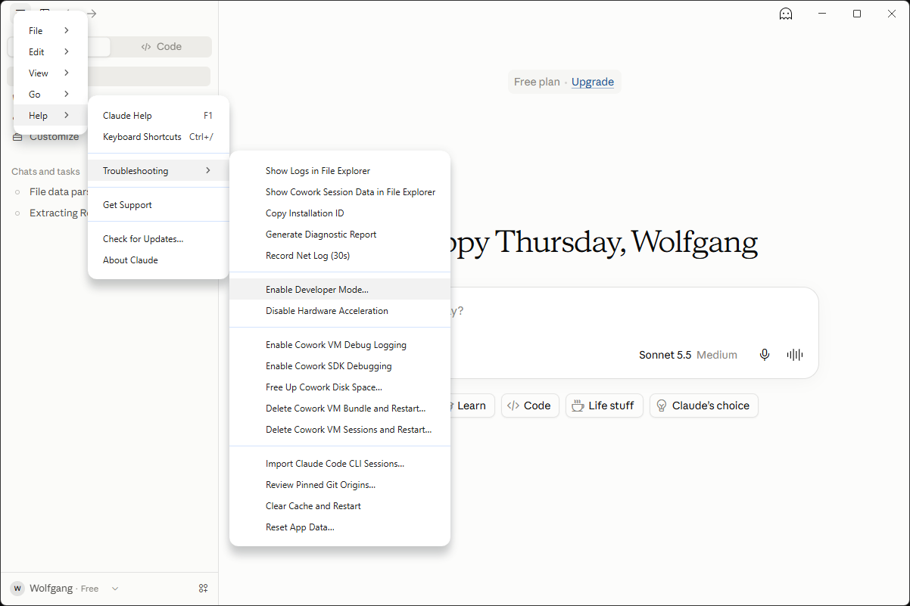
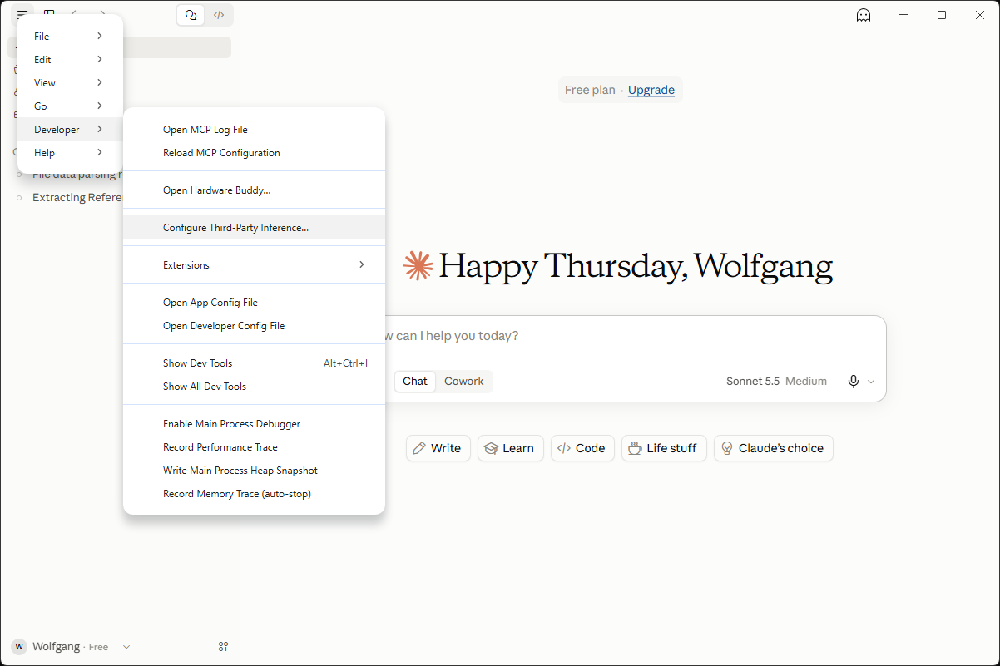
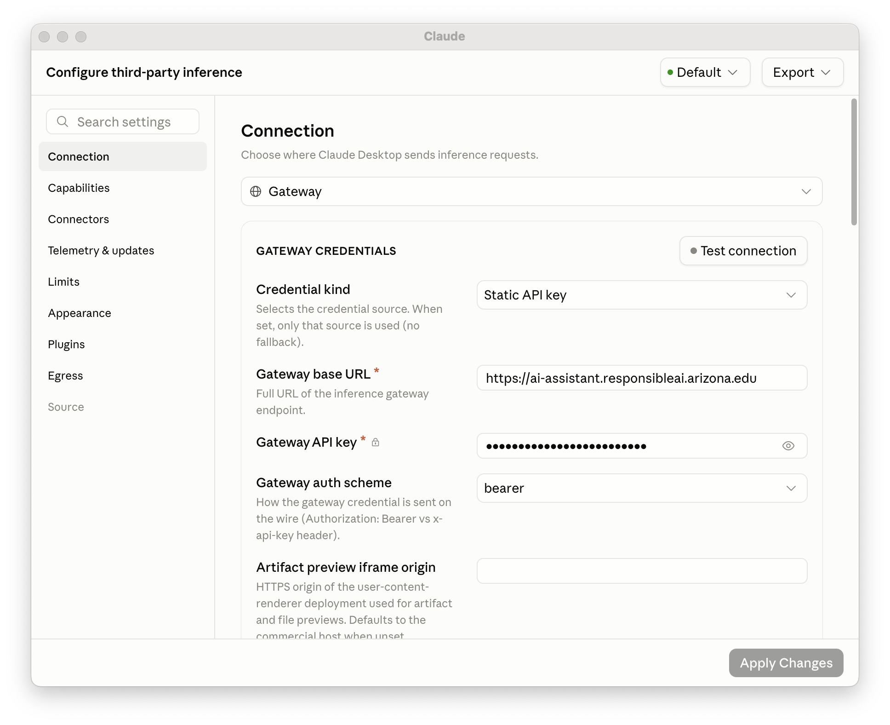
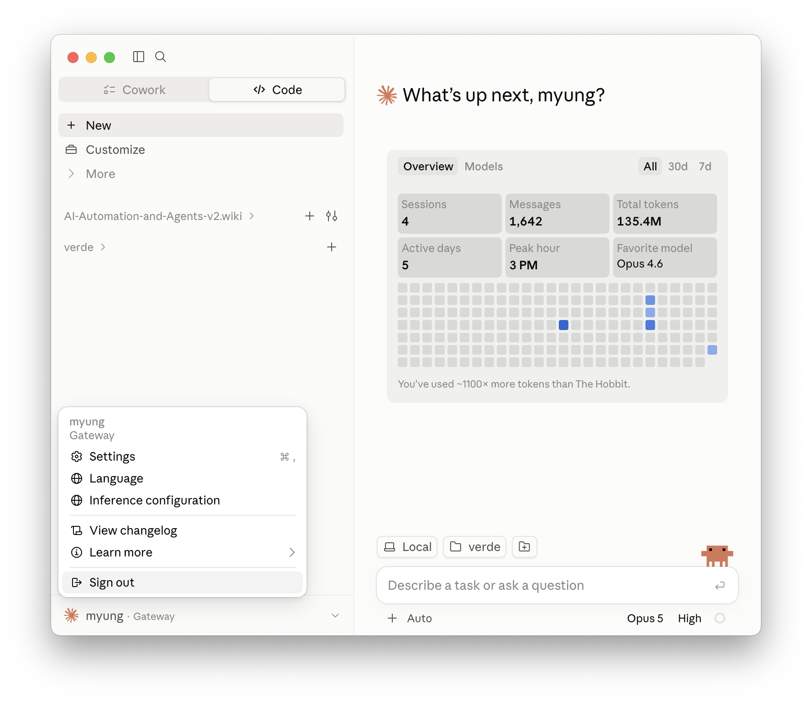
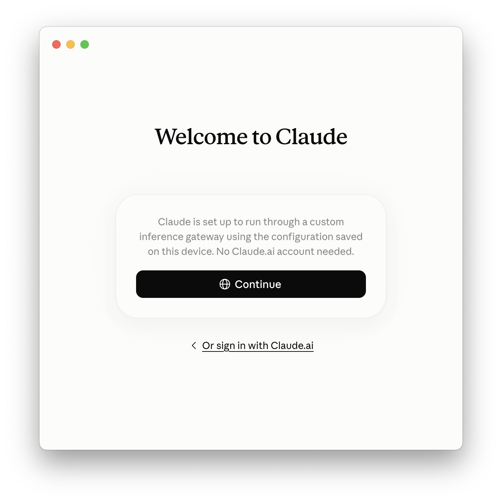

# Using Claude Desktop with AI Assistant

Claude Desktop is Anthropic's desktop chat application for Windows, macOS, and Linux (beta). You can configure it to send requests through the AI Assistant gateway using your AI Assistant API key instead of an Anthropic account.

!!! Note

    This requires enabling Developer Mode in Claude Desktop, which exposes advanced settings not shown by default.

!!! Warning

    If you were previously using Claude Desktop with an Anthropic account, your previous chats won't show up while using the AI Assistant gateway. You don't lose access to them — switch back to your Claude.ai sign-in to see them again (see [instructions below](#switch-back-to-a-claudeai-account)).

## Prerequisites

1. [Obtain your AI Assistant API key](api-key.md).
2. [Install Claude Desktop](https://claude.ai/download).

## 1. Enable Developer Mode

1. Open the **Help** menu.
2. Hover over **Troubleshooting**.
3. Click **Enable Developer Mode...**.
 
{: style="width:100%; height:auto;"}

## 2. Open the third-party inference settings

Once Developer Mode is enabled, a new **Developer** menu becomes available.

1. Open the application menu and select **Developer**.
2. Click **Configure Third-Party Inference...**.

{: style="width:100%; height:auto;"}

## 3. Configure the gateway

On the **Connection** settings page, configure the following fields:

1. Set the connection type dropdown to **Gateway**.
2. Set **Credential kind** to **Static API key**.
3. Set **Gateway base URL** to `https://ai-assistant.responsibleai.arizona.edu`.
4. Set **Gateway API key** to your AI Assistant API key.
5. Set **Gateway auth scheme** to **bearer**.
6. Click **Test connection** to verify the settings work.
7. Click **Apply Changes**.

{: style="width:100%; height:auto;"}

You can now use Claude Desktop as you normally would. Requests are sent through the AI Assistant gateway using your API key.

## Update your API key

Repeat step 3 above with your new AI Assistant API key in the **Gateway API key** field, then click **Apply Changes**.

## Switch back to a Claude.ai account

1. Click your account name in the bottom-left corner.
2. Click **Sign out**.

{: style="width:100%; height:auto;"}

On the welcome screen, you'll see that Claude is still configured to use the AI Assistant gateway.

1. Click **Or sign in with Claude.ai** instead of **Continue**.

{: style="width:100%; height:auto;"}

Once signed in with Claude.ai, requests go through your Anthropic account instead of the AI Assistant gateway, and your previous Claude.ai chats become visible again. Chats you had while using the gateway won't show up here — sign back into the gateway to see those. The gateway configuration stays saved, so you can switch back to it at any time by signing out and clicking **Continue** instead.
