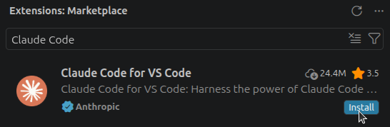
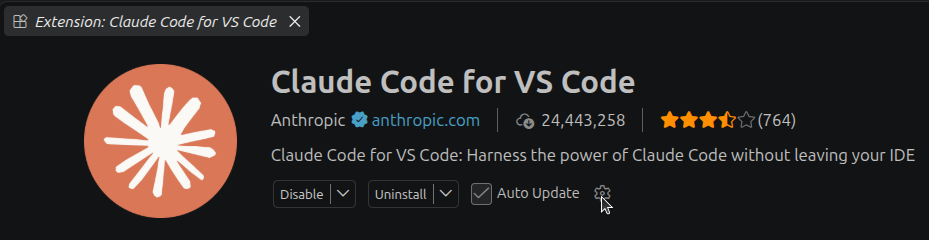
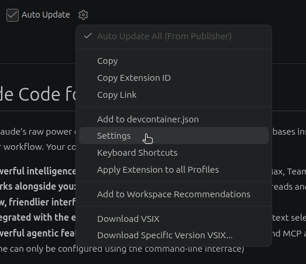
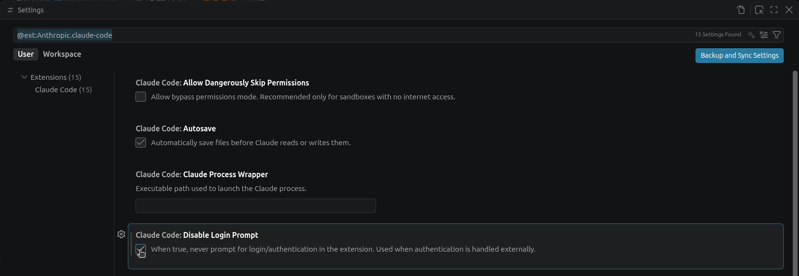
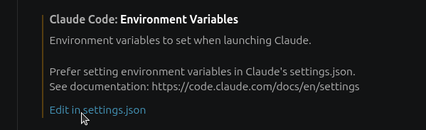
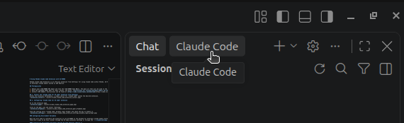
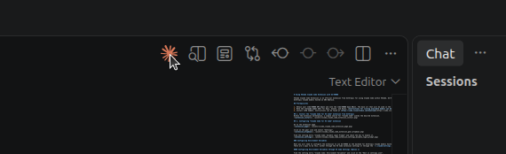

# Using Claude Code in VS Code with AI Assistant

Use Anthropic's Claude Code extension in VS Code to access Claude models hosted on AWS Bedrock through AI Assistant. AI Assistant handles AWS authentication and workspace budgets. Use your AI Assistant API key to connect.

For the terminal setup, see [Using Claude Code with AI Assistant](api-key-claude.md).

## Prerequisites

1. [Install VS Code](https://code.visualstudio.com/download).
2. [Obtain your AI Assistant API key](api-key.md).
3. Copy the exact Opus, Sonnet, and Haiku model IDs from your workspace's **Available Models** section. See [Check Your Available Models](api-key.md#5-check-your-available-models).

## 1. Install the extension

Open the **Extensions** view in VS Code, search for **Claude Code**, and install **Claude Code for VS Code** published by **Anthropic**.

{: style="width:480px; max-width:100%; height:auto;"}

## 2. Configure Bedrock

Open the installed extension's page.

{: style="width:640px; max-width:100%; height:auto;"}

Click the gear icon and select **Settings**.

{: style="width:400px; max-width:100%; height:auto;"}

Under **User** settings, enable **Claude Code: Disable Login Prompt**. This setting is required for both configuration options below.

{: style="width:100%; max-width:100%; height:auto;"}

Remove older `ANTHROPIC_BASE_URL`, `ANTHROPIC_API_KEY`, and `AWS_BEARER_TOKEN_BEDROCK` entries from your Claude Code configuration and any shell profile used to launch VS Code. `AWS_BEARER_TOKEN_BEDROCK` can override your AI Assistant credential.

Choose one of the following configuration options. Keep your key, endpoint, and model settings in the location you choose, and remove conflicting entries from the other location.

### Configure VS Code user settings

Open the Command Palette and select **Preferences: Open User Settings (JSON)**. Add the following settings to that file.

If settings already exist, merge these properties into the existing object. Replace the API key and model placeholders with values from your workspace. Use the same Sonnet model ID in both Sonnet entries.

```json
{
	"claudeCode.disableLoginPrompt": true,
	"claudeCode.environmentVariables": [
		{ "name": "ANTHROPIC_BASE_URL", "value": "" },
		{ "name": "ANTHROPIC_API_KEY", "value": "" },
		{ "name": "AWS_BEARER_TOKEN_BEDROCK", "value": "" },
		{ "name": "ANTHROPIC_AUTH_TOKEN", "value": "<your-ai-assistant-api-key>" },
		{ "name": "ANTHROPIC_BEDROCK_BASE_URL", "value": "https://ai-assistant.ai2s.org/bedrock" },
		{ "name": "CLAUDE_CODE_SKIP_BEDROCK_AUTH", "value": "1" },
		{ "name": "CLAUDE_CODE_USE_BEDROCK", "value": "1" },
		{ "name": "ANTHROPIC_DEFAULT_OPUS_MODEL", "value": "<opus-model-id>" },
		{ "name": "ANTHROPIC_DEFAULT_SONNET_MODEL", "value": "<sonnet-model-id>" },
		{ "name": "ANTHROPIC_DEFAULT_HAIKU_MODEL", "value": "<haiku-model-id>" },
		{ "name": "ANTHROPIC_MODEL", "value": "<sonnet-model-id>" }
	]
}
```

The empty values clear conflicting variables inherited by the Claude process. `ANTHROPIC_MODEL` selects your Sonnet model when a new session starts.

The extension also provides an **Edit in settings.json** shortcut under **Claude Code: Environment Variables**. Make sure you edit **User** settings.

{: style="width:520px; max-width:100%; height:auto;"}

If your workspace shows a different AI Assistant base URL, replace its trailing `/v1` with `/bedrock`.

??? note "Share settings with the Claude Code CLI"

    Use this option when you want the CLI and VS Code extension to use the same configuration. Keep **Claude Code: Disable Login Prompt** enabled in VS Code user settings:

    ```json
    {
    	"claudeCode.disableLoginPrompt": true
    }
    ```

    On Linux or macOS, edit `~/.claude/settings.json`. On Windows, edit `%USERPROFILE%\.claude\settings.json`.

    Add the following entries to its `env` section. If the file already contains settings, merge the entries into the existing object. Replace the placeholders with your workspace's API key and exact model IDs.

    ```json
    {
    	"env": {
    		"ANTHROPIC_BASE_URL": "",
    		"ANTHROPIC_API_KEY": "",
    		"AWS_BEARER_TOKEN_BEDROCK": "",
    		"ANTHROPIC_AUTH_TOKEN": "<your-ai-assistant-api-key>",
    		"ANTHROPIC_BEDROCK_BASE_URL": "https://ai-assistant.ai2s.org/bedrock",
    		"CLAUDE_CODE_SKIP_BEDROCK_AUTH": "1",
    		"CLAUDE_CODE_USE_BEDROCK": "1",
    		"ANTHROPIC_DEFAULT_OPUS_MODEL": "<opus-model-id>",
    		"ANTHROPIC_DEFAULT_SONNET_MODEL": "<sonnet-model-id>",
    		"ANTHROPIC_DEFAULT_HAIKU_MODEL": "<haiku-model-id>",
    		"ANTHROPIC_MODEL": "<sonnet-model-id>"
    	}
    }
    ```

    Use the same Sonnet model ID in both Sonnet entries. If your workspace shows a different base URL, replace its trailing `/v1` with `/bedrock`.

    Remove overlapping entries from `claudeCode.environmentVariables` in VS Code user settings. The shared file configures the Claude process, but its credentials do not satisfy the extension's own login check. Disabling the login prompt is required for this option.

For details on these settings locations, see [Claude Code gateway configuration](https://code.claude.com/docs/en/llm-gateway-connect#vs-code-extension) and [VS Code third-party provider setup](https://code.claude.com/docs/en/vs-code#use-third-party-providers).

## 3. Restart and verify the connection

Save your settings and restart VS Code. Open the Claude Code panel from the Activity Bar.

{: style="width:420px; max-width:100%; height:auto;"}

You can also open the panel by clicking the Claude Code icon in the editor toolbar.

{: style="width:420px; max-width:100%; height:auto;"}

Start a new conversation. Open the Claude Code command menu and select **Status**, or enter `/status` in the chat. Confirm the following:

- The API provider is **Amazon Bedrock**.
- The Bedrock base URL is `https://ai-assistant.ai2s.org/bedrock`, or your workspace's corresponding URL.
- AWS authentication is skipped.
- The selected model matches the Sonnet model ID you configured.

Send a short prompt, such as `Reply with hello`, and confirm you receive a response.

If the provider, URL, or model differs, check for overlapping settings in both configuration locations. If authentication fails, confirm your API key and clear any remaining `AWS_BEARER_TOKEN_BEDROCK` value.

## Turn off telemetry

To turn off Claude Code telemetry and other nonessential background traffic, add the following entry to the `claudeCode.environmentVariables` array when using VS Code user settings:

```json
{ "name": "CLAUDE_CODE_DISABLE_NONESSENTIAL_TRAFFIC", "value": "1" }
```

For shared Claude Code settings, add `"CLAUDE_CODE_DISABLE_NONESSENTIAL_TRAFFIC": "1"` to the `env` section instead. Restart VS Code after changing the setting.

This also disables Claude Code's automatic updates. See [Turn off telemetry](api-key-claude.md#turn-off-telemetry) in the CLI guide for details.

## Update your API key

Replace `ANTHROPIC_AUTH_TOKEN` in your chosen configuration location with your new AI Assistant API key. Restart VS Code and send a short test prompt to verify the new key.
