# Using Goose Desktop with AI Assistant

Goose is an open source AI agent available as a desktop application for Windows, macOS, and Linux. Use the OpenAI provider to connect Goose Desktop to models in your AI Assistant workspace.

## Prerequisites

1. [Obtain your AI Assistant API key](api-key.md).
2. Copy the exact model ID you want to use from your workspace. See [Check your available models](api-key.md#5-check-your-available-models).
3. [Install Goose Desktop](https://goose-docs.ai/docs/getting-started/installation/). Choose the desktop download for your operating system.

Choose a model that supports tool calling for Goose's agent features. See [Goose's model-selection guidance](https://goose-docs.ai/docs/getting-started/providers/) for details.

## 1. Connect to AI Assistant

If Goose already has a provider configured, skip to [Configure the OpenAI provider](#configure-the-openai-provider).

### First-time setup

1. Launch Goose Desktop.
2. Click **Connect to a Provider**.

    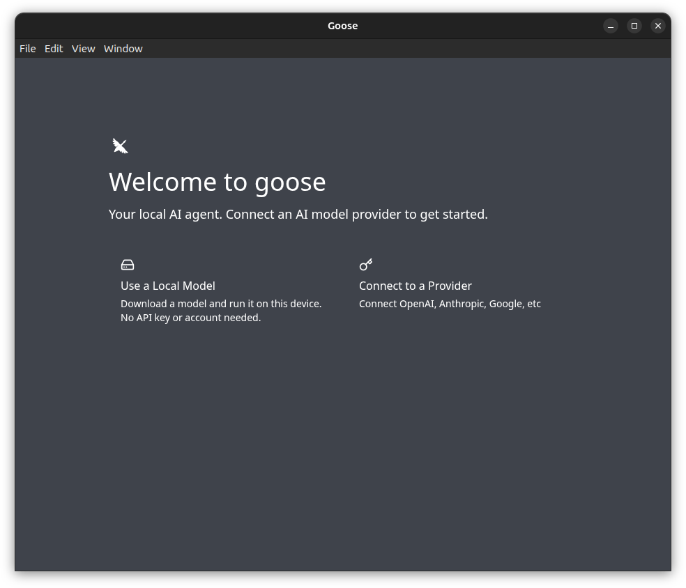{: style="width:620px; max-width:100%; height:auto;"}

3. Select **OpenAI** from the provider dropdown.
4. Leave **OpenAI API Key** empty during initial setup. Enter your key later in [Configure the OpenAI provider](#configure-the-openai-provider).

    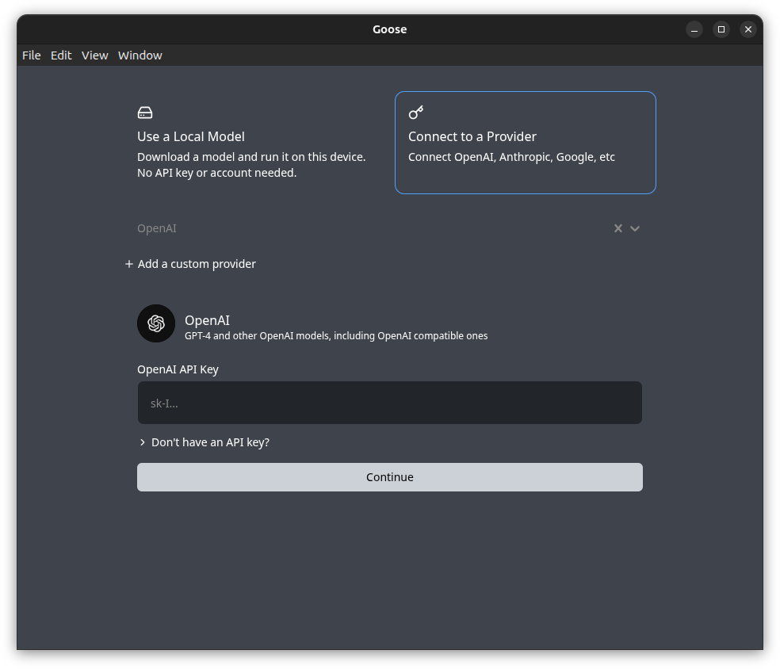{: style="width:620px; max-width:100%; height:auto;"}

5. Click **Continue**.
6. To turn off anonymous usage reporting, clear **Share anonymous usage data**.

    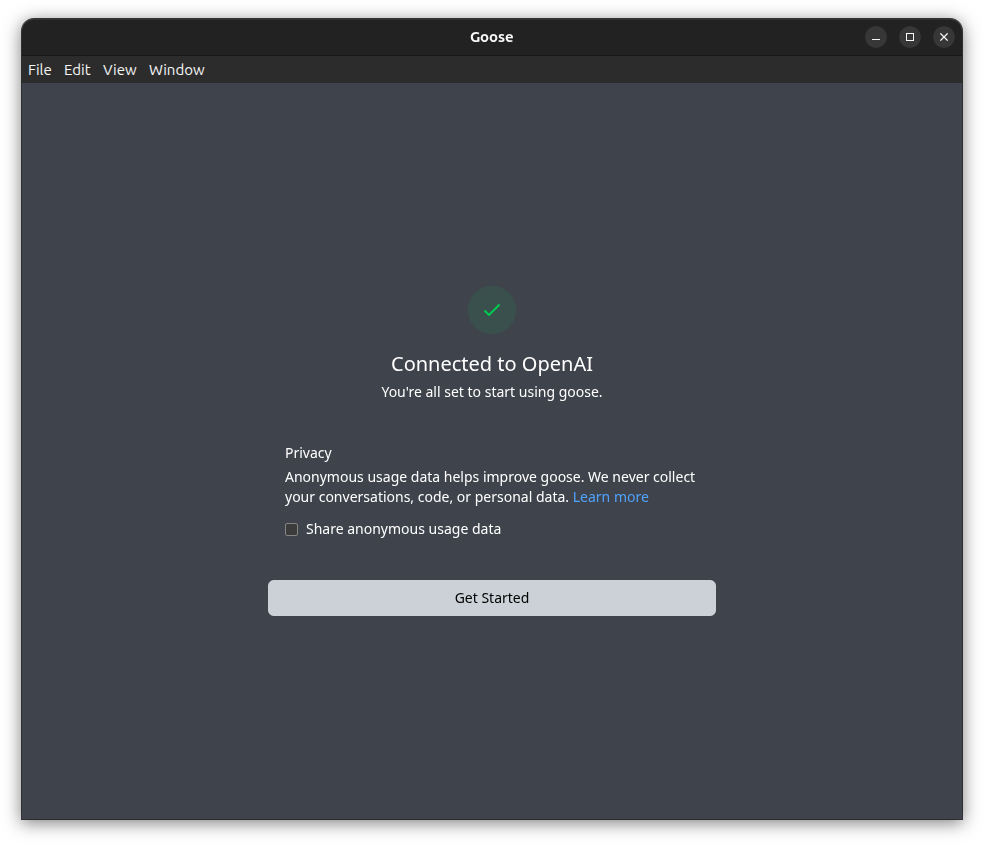{: style="width:620px; max-width:100%; height:auto;"}

7. Click **Get Started**.

Continue with the provider settings below to enter your AI Assistant key and endpoint before sending a prompt.

### Configure the OpenAI provider

Follow these steps after initial setup or to update an existing Goose configuration.

1. Click **Settings** at the bottom left of the Goose Desktop window.

    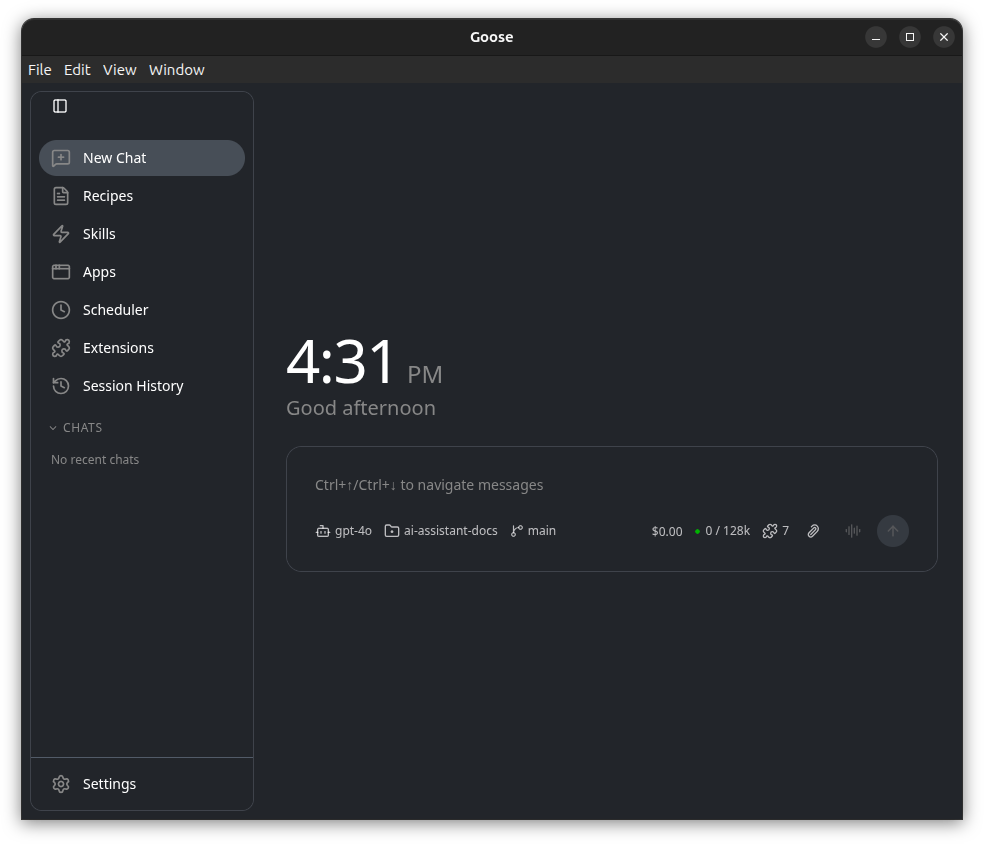{: style="width:620px; max-width:100%; height:auto;"}

2. Open **Models**.
3. Click **Configure providers**.

    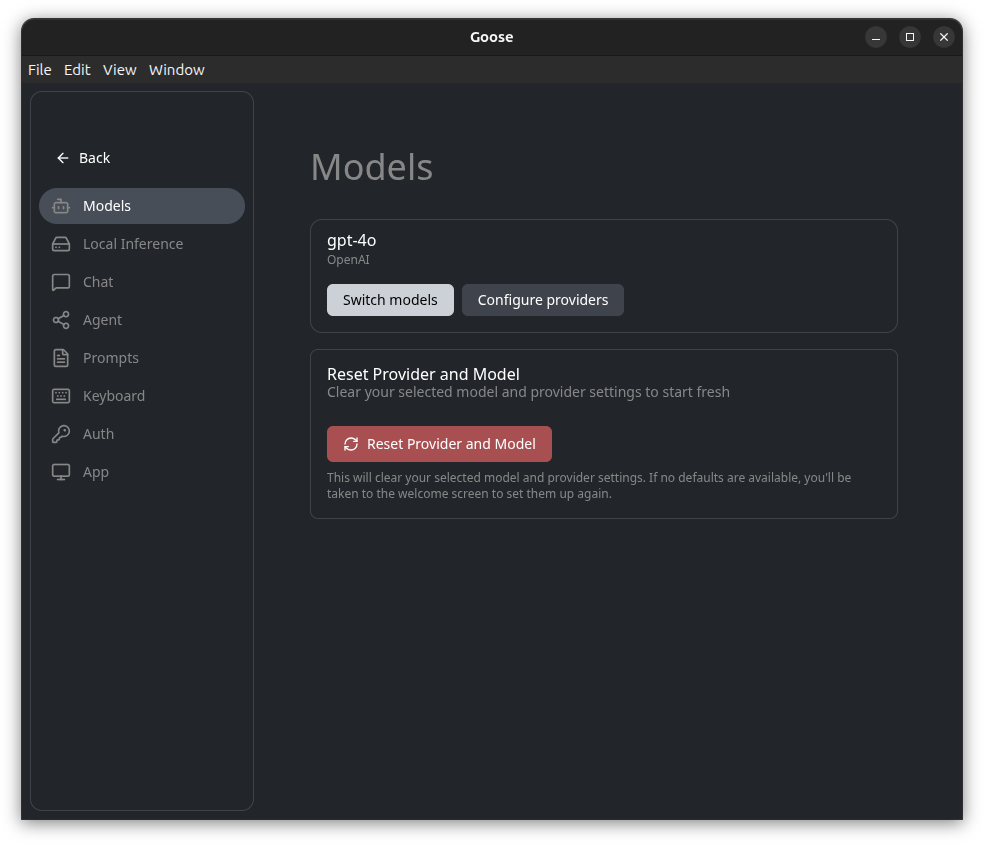{: style="width:620px; max-width:100%; height:auto;"}

4. Search for `OpenAI` in **Provider Configuration Settings**.
5. Click **Configure** on the **OpenAI** card.

    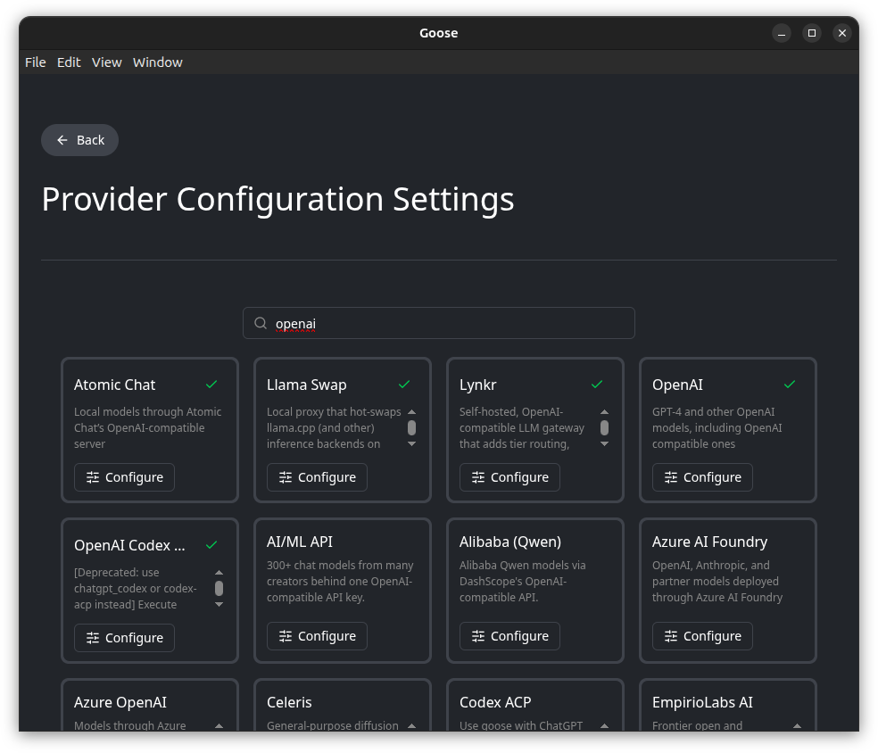{: style="width:620px; max-width:100%; height:auto;"}

6. Paste your AI Assistant API key into **OpenAI API Key** in the **Configure OpenAI** dialog.

    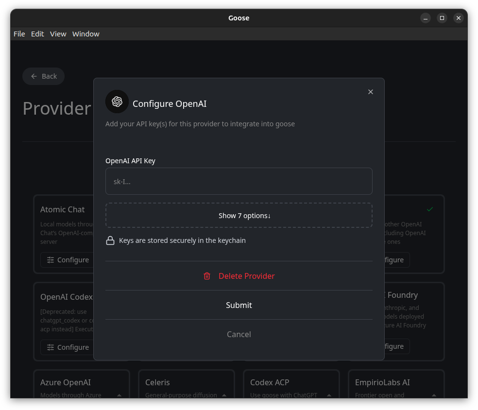{: style="width:620px; max-width:100%; height:auto;"}

7. Click **Show 7 options**.
8. Set the endpoint fields to the following values:

    | Field | Value |
    | --- | --- |
    | **Base Url** (`OPENAI_BASE_URL`) | `https://ai-assistant.responsibleai.arizona.edu/v1` |
    | **OpenAI Host** | `https://ai-assistant.responsibleai.arizona.edu` |
    | **OpenAI Base Path** | `v1/chat/completions` |

    If your workspace shows a different API base URL, use it for **Base Url** and remove its trailing `/v1` for **OpenAI Host**. Keep **OpenAI Base Path** as `v1/chat/completions`.

    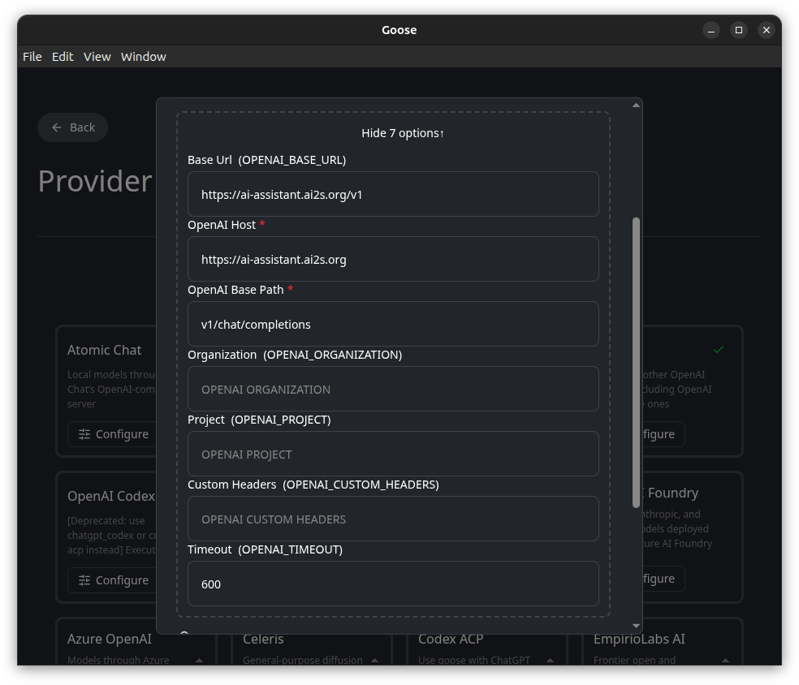{: style="width:620px; max-width:100%; height:auto;"}

9. Scroll to the bottom of the dialog and click **Submit**.

    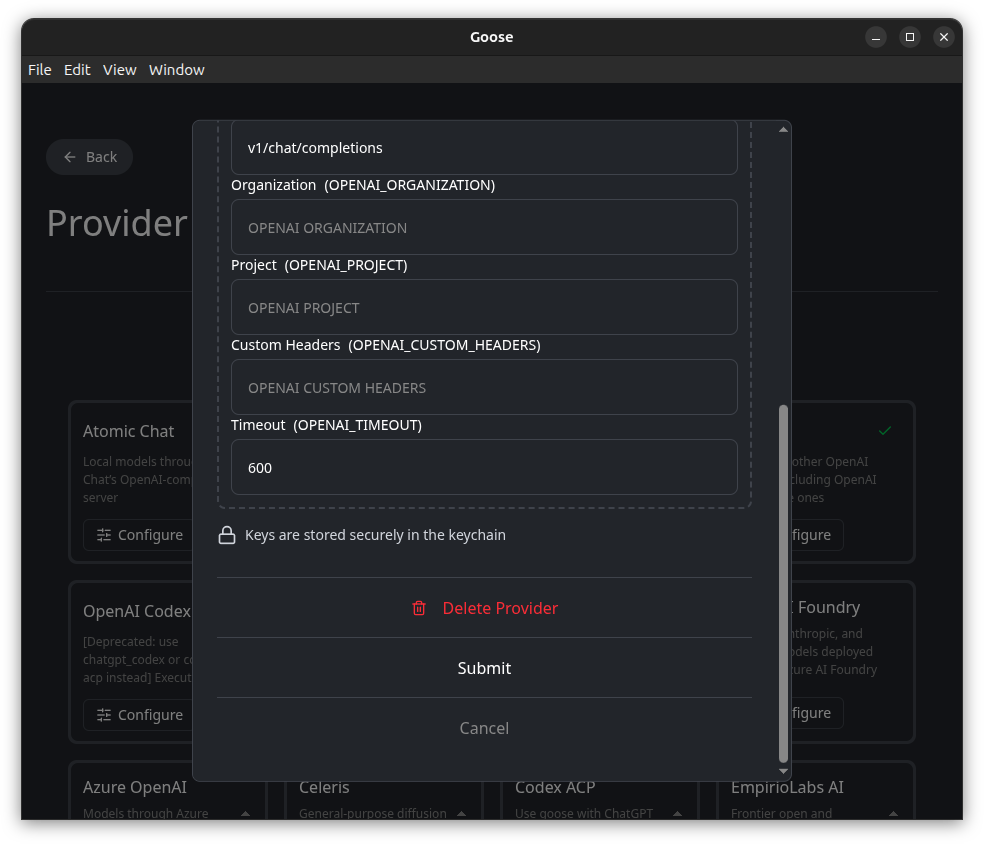{: style="width:620px; max-width:100%; height:auto;"}

Continue with [Select a model and verify the connection](#2-select-a-model-and-verify-the-connection).

## 2. Select a model and verify the connection

After you submit the provider settings, Goose opens **Choose Model**. To change the model later, open **Settings**, select **Models**, and click **Switch models**.

1. Select **OpenAI** from the provider dropdown.
2. Select a model whose ID matches one in your workspace's **Available Models** list.

    If the model is absent from the dropdown, select **Use custom model** and enter its exact workspace model ID.

    The model shown in the screenshots is an example. Use a model available in your workspace.

3. If **Thinking Effort** appears, leave it at its default.

    This setting controls how much reasoning the model uses before responding.

    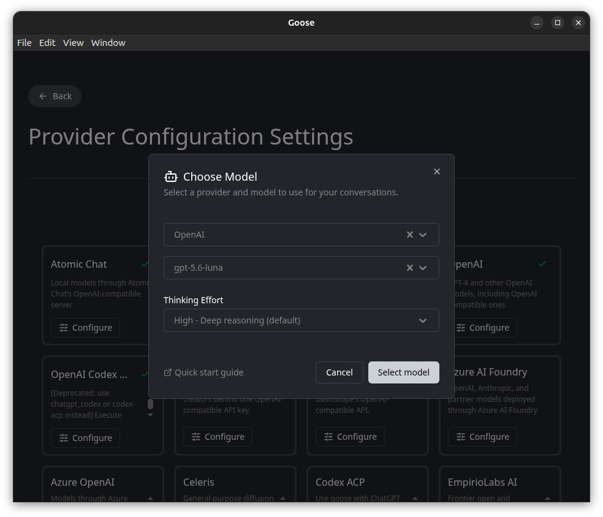{: style="width:620px; max-width:100%; height:auto;"}

4. Click **Select model**.
5. Confirm the **Model changed** notification names your chosen model and the OpenAI provider.

    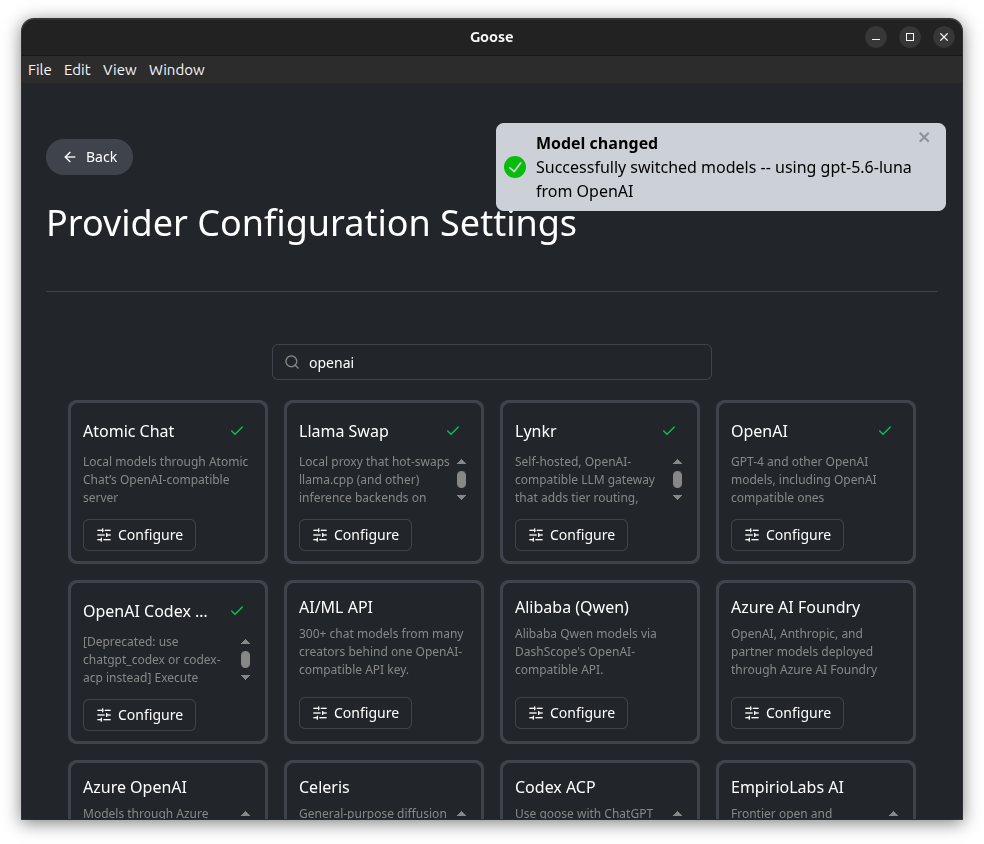{: style="width:620px; max-width:100%; height:auto;"}

6. Click **Back** to return to **Models**. Click **Back** again to return to the chat screen.
7. Click **New Chat** to start a conversation.
8. Confirm the model name below the chat box matches your chosen workspace model.
9. Send a short prompt, such as `Hi`. Confirm Goose displays a response.

    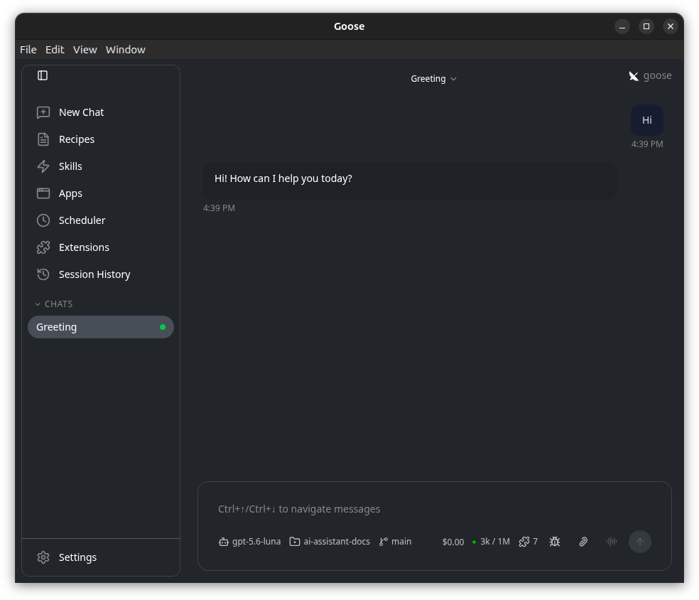{: style="width:620px; max-width:100%; height:auto;"}

If the request fails, check **OpenAI API Key**, **Base Url**, **OpenAI Host**, **OpenAI Base Path**, and the model ID against your workspace settings. For details, see [Goose's provider configuration instructions](https://goose-docs.ai/docs/getting-started/providers/).
